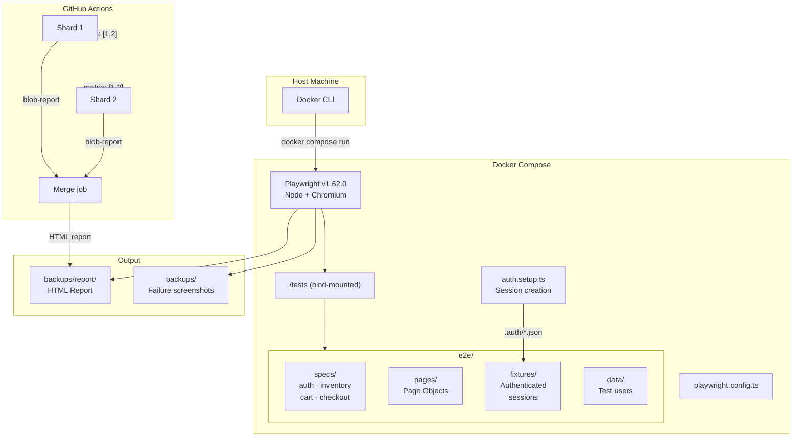
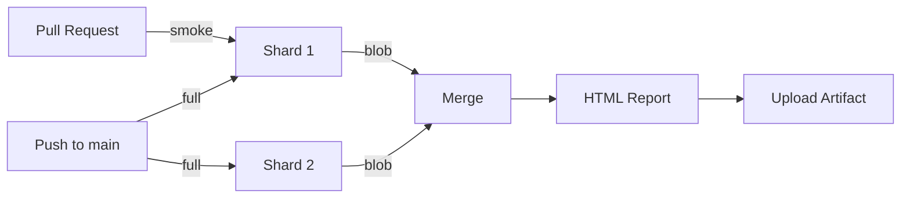

# Web E2E Testing — Playwright (TypeScript)

Containerized end-to-end test suite for [SauceDemo](https://www.saucedemo.com/),
built with **Playwright + TypeScript**. Runs identically in local Docker and
GitHub Actions with **zero package installation on the host**.

## Objective

Automate and validate the core user flows of SauceDemo — login, product
browsing, cart management, and checkout — through a maintainable, parallelizable
test suite that produces reliable evidence (HTML reports, failure screenshots)
on every run.

## Architecture



### Key Design Decisions

- **Page Object Model**: Specs describe *behavior*, not selectors. All
  locators live in `e2e/pages/`.
- **Authenticated fixtures**: Each test logs in fresh via `beforeEach` to avoid
  shared-session flakiness and cart state leakage between tests.
- **Zero retries**: A green run means genuinely stable tests. Known-flaky tests
  are quarantined with `@flaky` and run separately with retries.
- **Sharded execution**: Tests split across N parallel containers locally, or a
  2-shard CI matrix, with merged HTML reports.

## Tools

| Tool | Version | Purpose |
|------|---------|---------|
| [Playwright](https://playwright.dev/) | 1.62.0 | Browser automation framework |
| [TypeScript](https://www.typescriptlang.org/) | 5.6+ | Type-safe test code |
| [Docker](https://www.docker.com/) | Latest | Container runtime (no host deps) |
| [Docker Compose](https://docs.docker.com/compose/) | v2+ | Service orchestration |
| [pnpm](https://pnpm.io/) | 11.21.0 | Package manager (inside container) |
| [GitHub Actions](https://github.com/features/actions) | — | CI/CD pipeline |

## Getting Started

### Prerequisites

- **Docker** (with Compose v2): [Install Docker](https://docs.docker.com/get-docker/)

That's it. No Node.js, no npm, no browser installs on your host.

### Verify Docker Installation

```bash
# Check Docker is running
docker info > /dev/null 2>&1 && echo "Docker is ready" || echo "Docker is not running"

# Check Compose v2 is available
docker compose version
```

### 1. Clone repo

```bash
git clone https://github.com/leandjb/web-e2e-testing-playwright-typescript.git

cd web-e2e-testing-playwright-typescript

# edit your local .env textfile and fill variables
cp .env.example .env
```

**IMPORTANT:** The `.env` file is gitignored and **must never be committed**.

### 2. Run Tests

All commands run inside Docker — no host dependencies required.


**Smoke subset (single shard, fast feedback):**

```bash
docker compose run --rm -e SHARD_INDEX=1 -e TOTAL_SHARDS=1 e2e \
  bash -c "corepack enable && pnpm install --frozen-lockfile; node_modules/.bin/playwright test --shard=1/1 --grep @smoke"
```

**By tag — run only `@regression` tests:**

```bash
docker compose run --rm -e SHARD_INDEX=1 -e TOTAL_SHARDS=1 e2e \
  bash -c "corepack enable && pnpm install --frozen-lockfile; node_modules/.bin/playwright test --shard=1/1 --grep @regression"
```

**By file — run a specific spec:**

Note: Just REPLACE with specific PATH test-file such as 'e2e/specs/auth.spec.ts'

```bash
docker compose run --rm -e SHARD_INDEX=1 -e TOTAL_SHARDS=1 e2e \
  bash -c "corepack enable && pnpm install --frozen-lockfile; node_modules/.bin/playwright test --shard=1/1 e2e/specs/auth.spec.ts"
```

**By test title — run a specific test:**

Note: Just REPLACE with specific MESSAGE such as 'logs in successfully'

```bash
docker compose run --rm -e SHARD_INDEX=1 -e TOTAL_SHARDS=1 e2e \
  bash -c "corepack enable && pnpm install --frozen-lockfile; node_modules/.bin/playwright test --shard=1/1 -g 'logs in successfully'"
```

### 3. View Results 

```bash
open backups/report/index.html    # macOS
vim backups/report/index.html  # Linux
notepad.exe backups/report/index.html  # Windows
```

The report includes:
- Test results with pass/fail status
- Failure screenshots
- Trace files for debugging

### 4. Cleanup

```bash
docker compose down --remove-orphans
```

To also clear cached dependencies (forces reinstall on next run):

```bash
docker compose down -v
```

## Project Structure

```
.
├── e2e/
│   ├── data/           # Test user credentials
│   ├── fixtures/       # Authenticated test fixtures
│   ├── pages/          # Page Object Model classes
│   └── specs/          # Test files (auth, inventory, cart, checkout)
├── quality-control/
│   ├── test-plans/     # Module test plans with traceability
│   └── bug-reports/    # Defect documentation
├── .github/workflows/  # CI pipeline (smoke on PR, full on main)
├── auth.setup.ts       # Global setup: session creation
├── playwright.config.ts # Playwright configuration
├── docker-compose.yml  # Container services (e2e + merge)
└── .env.example        # Environment template (copy to .env)
```

## Test Tags

| Tag | Purpose | When to run |
|-----|---------|-------------|
| `@smoke` | Critical path tests | Every PR (fast feedback) |
| `@regression` | Full coverage | Main branch, scheduled |
| `@flaky` | Quarantined (retries: 2) | Isolated from stable run |

Run by tag with `--grep`:

```bash
# Smoke only
docker compose run --rm -e SHARD_INDEX=1 -e TOTAL_SHARDS=1 e2e \
  bash -c "corepack enable && pnpm install --frozen-lockfile; node_modules/.bin/playwright test --shard=1/1 --grep @smoke"

# Regression only
docker compose run --rm -e SHARD_INDEX=1 -e TOTAL_SHARDS=1 e2e \
  bash -c "corepack enable && pnpm install --frozen-lockfile; node_modules/.bin/playwright test --shard=1/1 --grep @regression"
```

## CI Pipeline

The GitHub Actions workflow runs automatically:

- **Pull requests** → smoke subset (1 shard)
- **Push to main** → full suite (2 shards + merged report)
- **Scheduled** (1st and 15th) → full suite



## Troubleshooting and problems

**Container won't start:**
```bash
docker compose down -v && docker compose pull
```

**Tests timeout:**
```bash
docker stats
```

